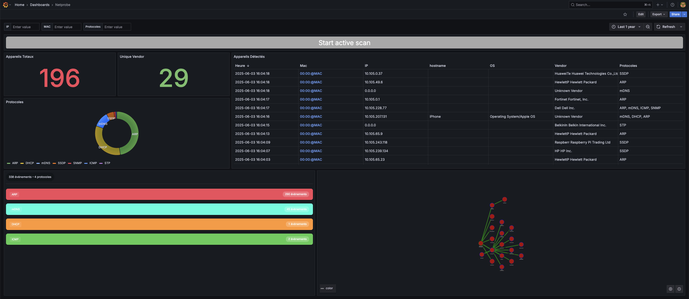

# NetProbe - Solution de Cartographie Réseau


## Description

NetProbe est une solution complète de cartographie réseau qui combine deux approches complémentaires :
- **Cartographie Passive** : Capture et analyse du trafic réseau en temps réel
- **Cartographie Active** : Scan actif du réseau pour découvrir et analyser les équipements

## Table des matières

1. [Fonctionnalités](#fonctionnalités)
2. [Architecture](#architecture)
3. [Prérequis](#prérequis)
4. [Installation](#installation)
5. [Utilisation](#utilisation)
6. [Configuration](#configuration)
7. [Documentation Technique](#documentation-technique)

## Fonctionnalités

### Cartographie Passive
- Capture de paquets réseau en temps réel
- Analyse multi-protocoles (ARP, DHCP, STP, etc.)
- Détection automatique des hôtes
- Stockage des informations dans une base de données MySQL
- Visualisation des données via Grafana
- Export des données au format JSON

### Cartographie Active
- Scan réseau actif
- Détection des services et ports ouverts
- Analyse SNMP
- Identification des systèmes d'exploitation
- Intégration avec la base de données commune

## Architecture

Le projet est composé de plusieurs conteneurs Docker :
- **netprobe** : Module de cartographie passive
- **active** : Module de cartographie active
- **mysql** : Base de données
- **grafana** : Interface de visualisation

## Prérequis

- Docker et docker-compose
- Python 3.x et pip
- iptables ou ufw
- Accès root/sudo

### Paquets système requis

Installation du resolver OID pour SNMP :
```bash
sudo apt install snmp-mibs-downloader
sudo sed -i 's/^mibs/#mibs/' /etc/snmp/snmp.conf
sudo download-mibs
```

## Installation

1. Cloner le dépôt :
```bash
git clone https://github.com/julien-lair/netprobe
cd netprobe
```

2. Préparation de l'environnement :
```bash
# Configurer les volumes pour Grafana
sudo chown -R 472:472 ./grafana_data/grafana-storage
```

3. Construction et lancement des conteneurs :
```bash
sudo docker compose up --build
```

Cette commande va :
- Construire l'image Docker pour le module passif
- Construire l'image Docker pour le module actif
- Démarrer tous les services (netprobe, active, mysql, grafana)

## Utilisation

### Accès aux interfaces

- **Grafana** : http://localhost:3000
  - Utilisateur : admin
  - Mot de passe : netprobe

  Aller dans Dashboard > Netprobe

  #### 1 - Fonctionnement général
  Grafana permet de visualiser les informations récupérées depuis la cartographie.
<br>Vous pouvez rechercher des appareils en fonction de leur IP, MAC ou protocoles : pour cela, entrez les informations de votre appareil en haut de la page.
<br>Vous devez actualiser la page avec le bouton "Refresh" (en haut à droite) pour voir les nouveaux appareils détectés.

  #### 2 - Partie Passive
  
  Voici un aperçu de la page de cartographie passive. Vous y trouverez des statistiques ainsi qu’un tableau listant tous les appareils détectés et leurs informations (MAC, IP, Hostname, OS, fournisseur, protocoles utilisés).
<br><br>**En cliquant** sur Start Active Scan, vous serez redirigé vers la partie active.
<br><br>**En cliquant** sur une adresse MAC, vous pourrez visualiser plus en détail les <u>informations échangées dans les protocoles</u>, ainsi qu’un <u>graphe</u> illustrant les relations entre l’appareil sélectionné et ses voisins.

  #### 3 - Partie Active
  Dans cette section, vous pouvez lancer différents types de scans :

- **ARP :** les IP inconnues détectées par la partie passive peuvent être interrogées.
- **mDNS :** lancez un scan mDNS pour découvrir les appareils de votre réseau (caméras, imprimantes, services SSH, etc.).
- **SNMP** (IP unique ou /24) : lancez un scan SNMP sur une IP précise ou une plage en /24 pour obtenir des informations sur les appareils.
- **SNMP** (scan réseau) : vous pouvez également scanner l’ensemble du réseau pour détecter les ports 161 (SNMP) ouverts.
- **HTTP(S) :** scannez une IP ou une plage en /24 pour trouver les ports web ouverts ; un aperçu des URL vous affichera les informations collectées.
- **SSH :** scannez une IP ou une plage en /24 pour découvrir les ports 22 ouverts.

### Commandes utiles

- Voir les logs de la cartographie passive :
```bash
docker logs -f netprobe
```

- Voir les logs de la cartographie active :
```bash
docker logs -f active
```

- Arrêter tous les services :
```bash
sudo docker-compose down
```

- Redémarrer un service spécifique :
```bash
sudo docker-compose restart [service_name]
```
Où [service_name] peut être : netprobe, active, mysql, ou grafana

## Configuration

### Variables d'environnement

#### Module Passif (netprobe)
- `INTERFACE` : Interface réseau à surveiller
- `TIMEOUT` : Durée de capture (-1 pour illimité)
- `DB_HOST` : Hôte MySQL
- `DB_PORT` : Port MySQL
- `DB_USER` : Utilisateur MySQL
- `DB_PASSWORD` : Mot de passe MySQL
- `DB_NAME` : Nom de la base de données

#### Module Actif
- Mêmes variables de base de données que le module passif

### Configuration de la base de données

La base de données MySQL est automatiquement configurée avec :
- Base : netprobe_db
- Utilisateur : netprobe
- Mot de passe : netprobe

## Documentation Technique

### Structure du projet

```
.
├── active/                 # Module de cartographie active
│   ├── Dockerfile
│   ├── main.py
│   └── requirements.txt
├── Analyzers/             # Analyseurs de protocoles
├── build/                 # Fichiers de compilation
├── docs/                  # Documentation détaillée
├── Layers/                # Définition des couches réseau
├── Scripts/              # Scripts utilitaires
└── docker-compose.yml    # Configuration des conteneurs
```

### Développement

#### Compilation depuis les sources

1. Prérequis de développement :
- CMake 3.5.0 ou supérieur
- PcapPlusPlus
- Boost
- JSONCPP

2. Compilation :
```bash
mkdir build
cd build
cmake ..
make
```

### Ajout d'un nouvel analyseur

Pour ajouter un nouvel analyseur de protocole :
1. Créer une nouvelle classe dans le dossier `Analyzers/`
2. Hériter de la classe de base `Analyzer`
3. Implémenter les méthodes requises
4. Enregistrer l'analyseur dans le gestionnaire de capture

## Licence

Ce projet est sous licence MIT. Voir le fichier LICENSE pour plus de détails.
