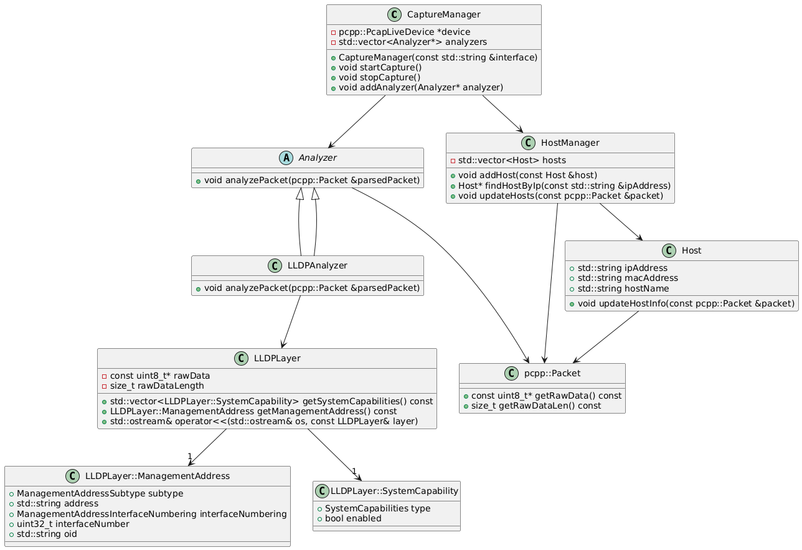

# Processus de fonctionnement de NetProbe

## Initialisation

1. **Chargement de la base de données des vendeurs**
   ```cpp
   loadVendorDatabase("/netprobe/build/manuf", vendorDatabase);
   ```
   - Charge la base de données MAC/Vendeur pour l'identification des équipements

2. **Configuration de l'interface**
   - Récupération de l'interface réseau depuis les variables d'environnement
   - Initialisation du périphérique de capture avec PcapPlusPlus

3. **Initialisation des composants**
   - Création du HostManager pour la gestion des hôtes
   - Configuration des gestionnaires de signaux (SIGUSR1, SIGINT, SIGTERM)
   - Initialisation des analyseurs de protocoles

## Capture et analyse

### Module Passif

1. **Capture des paquets**
   - Le CaptureManager démarre la capture sur l'interface spécifiée
   - Utilisation de callbacks PcapPlusPlus pour la réception des paquets

2. **Distribution des paquets**
   ```cpp
   void handlePacket(pcpp::RawPacket *rawPacket) {
       pcpp::Packet parsedPacket(rawPacket);
       for (Analyzer* analyzer : analyzers) {
           analyzer->analyzePacket(parsedPacket);
       }
   }
   ```
   - Chaque paquet est parsé et envoyé à tous les analyseurs enregistrés

3. **Analyse des protocoles**
   - Chaque analyseur traite les paquets correspondant à son protocole
   - Extraction des informations pertinentes :
     - Adresses MAC et IP
     - Noms d'hôtes
     - Services
     - Informations de topologie

4. **Mise à jour des informations**
   - Le HostManager met à jour la base de données avec les nouvelles informations
   - Les données sont stockées dans MySQL pour persistance

### Module Actif

1. **Scan réseau**
   - Scan périodique des sous-réseaux découverts
   - Détection des ports ouverts
   - Identification des services

2. **Requêtes SNMP**
   - Interrogation des équipements supportant SNMP
   - Récupération des informations système
   - Collecte des données de performance

## Stockage et visualisation

1. **Base de données**
   - Structure relationnelle pour stocker :
     - Informations des hôtes
     - Relations entre équipements
     - Historique des découvertes
     - Métriques de performance

2. **Grafana**
   - Tableaux de bord personnalisés
   - Visualisation de la topologie
   - Graphiques d'évolution
   - Alertes configurables

## Gestion des événements

1. **Signaux système**
   - SIGUSR1 : Déclenche l'export des données
   - SIGINT/SIGTERM : Arrêt propre du programme

2. **Erreurs et exceptions**
   - Gestion des erreurs de capture
   - Récupération des exceptions
   - Logs détaillés

## Optimisations

1. **Performance**
   - Utilisation de threads pour la capture
   - Gestion asynchrone des signaux
   - Optimisation des requêtes SQL

2. **Ressources**
   - Limitation de la mémoire utilisée
   - Gestion efficace des connexions à la base de données
   - Nettoyage périodique des données obsolètes

## Components

### CaptureManager

The CaptureManager is responsible for managing packet capture on a network interface and distributing captured packets to a list of analyzers. It provides methods to start and stop packet capture, add analyzers to the list, and handle packet distribution to the analyzers.

### Analyzers

Analyzers are responsible for analyzing specific types of network packets. Each analyzer inherits from the abstract base class Analyzer and implements the analyzePacket method to handle packets of a specific protocol. The application includes several analyzers, such as:

- **ARPAnalyzer**: Analyzes ARP packets and updates the host manager.
- **DHCPAnalyzer**: Analyzes DHCP packets and updates the host manager.
- **mDNSAnalyzer**: Analyzes mDNS packets and updates the host manager.
- **STPAnalyzer**: Analyzes STP packets and updates the host manager.

### HostManager

The HostManager manages host information and updates the JSON representation of hosts. It maintains a database of hosts and updates their information based on captured packets.

## Process Flow

<ol> 
  <li><b>Initialization</b>:</li>

- The application starts by loading the vendor database using the loadVendorDatabase function.
- The network interface and timeout duration are retrieved from environment variables.
- The HostManager is created to manage host information.

<li><b>Packet Capture</b>:</li>

- The CaptureManager is created and initialized with the network interface.
Various analyzers (e.g., DHCPAnalyzer, mDNSAnalyzer, ARPAnalyzer, STPAnalyzer) are created and added to the CaptureManager.

<li><b>Starting Capture</b>:</li>

- The CaptureManager starts capturing packets on the specified network interface.
Captured packets are distributed to the analyzers for processing.

<li><b>Packet Analysis</b>:</li>

- Each analyzer processes the packets it receives. For example, the mDNSAnalyzer extracts DNS queries and responses from mDNS packets and updates the host manager with the extracted information.

<li><b>Host Management</b>:</li>

- The HostManager updates the host database with information extracted from the analyzed packets. This includes updating MAC addresses, hostnames, IP addresses, and other relevant details.

<li><b>Signal Handling</b>:</li>

- When a specific signal is received, the HostManager dumps the current host information to a JSON file.
</ol>

## Class Diagram

If we take LLDP as an example, we have the following class diagram:



[]: # (END) docs/process.md

[]: # (BEGIN) docs/uml_diagram_LLDP.png
